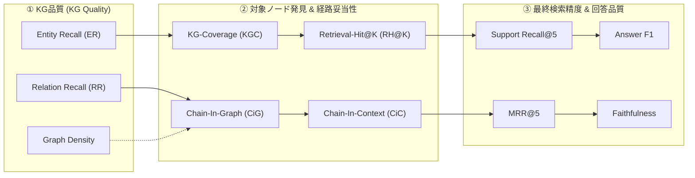

# SWO69 実験計画書：ナレッジグラフ（KG）品質のGraph-Based RAGの検索性能への影響

> **対象研究計画**：[`SWO.md`](file:///home/aad13623fe/CausalHippo/SWO69/SWO.md)
> **発表タイトル**：ナレッジグラフ（KG）品質のGraph-Based RAGの検索性能への影響  
> **対象システム**：GraphRAG, LightRAG, PathRAG, HippoRAG, YoutuRAG（5系統）  
> **実行基盤**：本リポジトリ既存実行基盤（`shared.eval.graph.MultiConditionGraphExperimentKt`, `shared.eval.MultiConditionExperimentKt`, 統合SPI `UnifiedRag`）および解析スクリプト群

---

## 0. `SWO.md` 発表概要との対応表（Traceability Matrix）

本実験計画の各章・指標・実験タスクが、[`SWO.md`](file:///home/aad13623fe/CausalHippo/SWO69/SWO.md) のアブストラクト記述と1対1でどのように対応しているかを下表に示す。

| `SWO.md` の記述項目・キーワード | 本計画書における具体化・操作化 | 対応セクション / 成果物 |
|---|---|---|
| **対象5系統**<br>「GraphRAG、LightRAG、PathRAG、HippoRAG、YoutuRAG」 | 5つの異なるKG構築方式（Leiden/コミュニティ型、AiServices単パス型、JSONプロンプト型、2フェーズOpenIE+KNN同義エッジ型、スキーマ進化型）の統一評価 | §2.1 対象システム<br>§7 T6（統合実行スクリプト） |
| **KG品質指標の整理**<br>「エンティティ抽出精度、関係抽出精度、グラフ密度などのKG品質指標を整理」 | ・**エンティティ抽出精度**：Entity Recall (ER), Entity Precision (EP), 重複実体率<br>・**関係抽出精度**：Relation Recall (RR), Relation Precision (RP), 抽出失敗率<br>・**グラフ密度・構造指標**：Density, \|V\|, \|E\|, 次数Gini係数, 孤立ノード率, 巨大成分率 | §3.2 抽出精度指標<br>§3.3 構造指標<br>Table 1, Table 2 |
| **検索精度・回答品質との関連**<br>「検索精度・回答品質との関連を比較分析した」 | ・**検索精度**：Support Recall@1/3/5, Bridge Coverage@5, MRR@5, nDCG@5<br>・**回答品質**：Exact Match (EM), Token F1, BertScore (P/R/F1), Faithfulness, Groundedness<br>・**相関分析**：Spearman順位相関行列、固定効果回帰モデル | §4.1 既存性能指標<br>§6 分析方法<br>Table 3, Figure 3 |
| **検索対象ノードの発見率**<br>「検索対象ノードの発見率や推論経路の妥当性に影響し」 | ・**KG-Coverage**（KGインデックス側実体網羅率：gold実体がKGノードに存在するか）<br>・**Retrieval-Hit@K**（検索コンテキスト側実体網羅率：gold実体がtop-K文書に含まれるか）<br>・**Discovery-Conversion Rate**（KG上のノードがどれだけ検索コンテキストに引き上げられたか） | §4.2 新設指標<br>Figure 1, Table 2 |
| **推論経路の妥当性**<br>「検索対象ノードの発見率や推論経路の妥当性に影響し」 | ・**Chain-In-Graph**（gold多段推論連鎖のパスがKG内に存在するか：BFS判定）<br>・**Chain-In-Context**（検索コンテキストが推論連鎖実体をすべて網羅しているか）<br>・**Path-Length Ratio**（KG上最短路長 / gold連鎖長の比：迂回・ショートカット度） | §4.2 新設指標<br>Table 2, Table 3 |
| **性能を左右する重要要因の論証**<br>「Graph-Based RAGの性能を左右する重要要因であることを示す」 | ・**E0（ベースライン）**：5系統×3データセットにおける品質と性能の自然相関<br>・**E1（抽出LLM品質操作）**：生成LLMを固定し抽出LLMのみ3層操作して因果検証<br>・**E2（KG事後パーテーション）**：gold実体選択的削除（P3）vs 汎用エッジノイズ（P1/P2/P5）の介入実験 | §5 実験マトリクス (E0, E1, E2)<br>Figure 2（劣化曲線） |

---

## 1. 研究疑問（Research Questions）と検証仮説

- **RQ1（KG構築特性の差異）**：5系統が同一テキストから構築するKGは、抽出精度（gold照合）およびグラフ構造特性（密度・次数分布・連結性）においてどのように異なるか？
- **RQ2（検索性能への影響メカニズム）**：KG品質指標（ER/RR/密度）は、検索対象ノードの発見率（KG-Coverage/Retrieval-Hit）および推論経路の妥当性（Chain-In-Graph/Context）とどのように連動・相関するか？
- **RQ3（最終生成品質への波及）**：KG品質および検索精度の差異は、最終回答品質（EM/F1/BertScore/Faithfulness）までどの程度直接的に波及するか？
- **RQ4（支配的品質次元の特定）**：抽出recall、抽出precision、グラフ密度、構造ノイズのうち、Graph-Based RAGの性能を最も強く支配する要因はどれか？

### 検証仮説

- **H1（実体網羅性の支配）**：エンティティ抽出Recall（gold実体の網羅率）は、検索対象ノード発見率（Retrieval-Hit）および回答F1と最も強い正の相関を示す。
- **H2（構造密度の非線形性・量≠質）**：エッジ数やグラフ密度の「量」単独では検索精度・回答品質と線形相関しない（高密度でもノイズエッジが多い場合はむしろPPR/経路検索を阻害する）。
- **H3（選択的欠落の致命性）**：gold推論連鎖実体の選択的削除（P3）は、同等以上の割合のランダムエッジ削除（P1）やランダムノード削除（P2）に比べ、検索性能・回答F1に対して有意に大きな劣化をもたらす。

---

## 2. 実験対象

### 2.1 対象システム（本リポジトリ実装済み 5系統）

| 系統 | Condition ID | 実行ランナー / クラス | 抽出・KG構築方式（[`KGConstruction.md`](file:///home/aad13623fe/CausalHippo/KGConstruction.md) 参照） | グラフ永続化形式 |
|---|---|---|---|---|
| **GraphRAG** | `graphrag` | `run_experiment_graph.sh`<br>（`shared.eval.graph.MultiConditionGraphExperimentKt`） | シングルパスLLM抽出 + Leidenコミュニティ検出 + 記述要約 | Parquet (`output/*.parquet`) |
| **LightRAG** | `lightrag` | 同上（`MultiConditionGraphExperimentKt`） | AiServices単パス抽出 + 名前キー統合 + KV/VDB連携 | JSON (`kv_store_*.json`, Graph JSON) |
| **PathRAG** | `pathrag` | 同上（`MultiConditionGraphExperimentKt`） | JSONプロンプト単パス抽出 + パス探索 + キャッシュ | NetworkX / JSON (`llm_cache.json`, Graph JSON) |
| **HippoRAG** | `hipporag_graph` | `run_experiment.sh`<br>（`shared.eval.MultiConditionExperimentKt`） | 2フェーズOpenIE（NER→3要素組）+ KNN同義エッジ + PPR | `SimpleGraph` JSON + 3種EmbeddingStore |
| **YoutuRAG** | `youturag` | グラフ/RAGランナー共通（`--use-unified-api` 必須） | スキーマ駆動抽出 + スキーマ進化 + TreeComm | JSON (`graph.json`, `chunks.jsonl`) |

> **実行上の注意点**：
> 1. `hipporag_graph` はRAG系ランナー（`MultiConditionExperiment.kt`）、`graphrag`/`lightrag`/`pathrag` はグラフ系ランナー（`MultiConditionGraphExperiment.kt`）に分かれているため、SWO69統合スクリプト（T6: `run_experiment_swo69.sh`）で全系統をシームレスに順次実行する。
> 2. `youturag` の実行には `--use-unified-api=true` が必須。
> 3. `graphrag` はランナーの仕様上 `--provider openai` ＋ APIキーの指定が必要となるため、ローカルOllama環境ではOpenAI互換エンドポイント（`http://localhost:11434/v1`＋ダミーAPIキー）を介して実行する。

### 2.2 データセット（30サンプル評価セット）

| データセット | 件数 | 構造gold注釈の所在 | 本研究における役割 |
|---|---|---|---|
| **MuSiQue** (`data/musique_experiment/musique_dev_balanced_30.jsonl`) | 30 | `question_decomposition[].answer`（ブリッジ実体）+ `answer`/`answer_aliases` | **多段推論・推論経路妥当性の主軸**（gold実体連鎖が得られる） |
| **Causal-Reasoning-QA** (`data/causal_experiment/causal_qa_balanced_30.jsonl`) | 30 | `metadata.cause_candidate`, `metadata.effect`, `label_true` | **因果関係抽出精度・エッジ正当性の主軸**（gold cause→effect が得られる） |
| **Webis-CausalQA-22** (`data/webis_experiment/webis_train_balanced_30.jsonl`) | 30 | なし（文書テキスト＋QAペアのみ） | **一般化検証・回答品質の補助評価軸**（構造指標・LLM採点） |

> **30件データセット生成手順（決定論的サブセット、seed 42）**：
> - MuSiQue：`python3 scripts/prepare_musique_experiment_data.py --balanced-size 30 --seed 42`
> - Causal-Reasoning-QA：`python3 scripts/prepare_causal_experiment_data.py --target-size 30 --seed 42`（※`--target-size` を使用）
> - Webis：`python3 scripts/prepare_webis_experiment_data.py --balanced-size 30 --seed 42`

### 2.3 LLM構成（ローカルOllamaスタック）

| 役割 | 強モデル（主評価） | 中モデル（E1用） | 弱モデル（E1用） |
|---|---|---|---|
| **抽出（KG構築）** | `qwen3.8:27b` | `gemma4:e4b`（代替: `qwen3:8b`） | `llama3.2:3b` |
| **回答生成** | `qwen3.8:27b`（全実験固定） | —（固定） | —（固定） |
| **埋め込み** | `nomic-embed-text`（全実験固定） | —（固定） | —（固定） |

- **交絡因子の統制**：回答生成モデルと埋め込みモデルを完全に固定することで、検索精度・回答品質の変動を「KG品質の差異」のみに帰因させる。
- **共通推論パラメータ**：top-k = 5, temperature = 0, seed固定。

---

## 3. KG品質の操作化と定量的定義

### 3.1 gold注釈の利用（正解基準の構築）

- **MuSiQue**：
  - 各サンプルのgold実体集合 $E_{\text{gold}} = \{q_d[i].\text{answer} \mid i \in [1..N]\} \cup \{\text{answer}\} \cup \text{answer\_aliases}$
  - gold連鎖 $C_{\text{gold}} = (e_1 \to e_2 \to \dots \to e_m)$ （分解クエリの各ステップの解を結んだパス）
- **Causal-Reasoning-QA**：
  - gold実体集合 $E_{\text{gold}} = \{\text{cause\_candidate}, \text{effect}\}$
  - goldエッジ $R_{\text{gold}} = (\text{cause\_candidate} \to \text{effect})$（`label_true=true` の成立例、`false` の非成立例を分離集計）
- **テキスト正規化・照合判定**：
  - 小文字化、冠詞除去、記号除去、単語境界部分文字列一致、および埋め込み類似度（閾値 0.85）によるエイリアスマッチ。

### 3.2 抽出精度指標（Extraction Quality Metrics）

| 指標名 | 略称 | 定義式 / 算出ロジック | 意味・役割 |
|---|---|---|---|
| **Entity Recall** | **ER** | $\frac{\|V_{\text{KG}} \cap E_{\text{gold}}\|}{\|E_{\text{gold}}\|}$ | gold実体をKGノードとして漏れなく抽出できている割合 |
| **Entity Precision** | **EP** | ① 文書グラウンディング率（抽出ノードのsurface formが元文書に出現する割合）<br>② LLM-as-a-Judgeによる妥当性判定率（文書文脈に基づく有効実体率） | 抽出された実体の正確性・幻覚（ハルシネーション）の少なさ |
| **Duplicate Entity Ratio** | **DER** | $\frac{\text{近似重複ノードペア数}}{\|V_{\text{KG}}\|}$ | 同一実体が別名・重複して登録されている割合（名寄せ能力の評価） |
| **Relation Recall** | **RR** | Causal: goldエッジ $(c \to e)$ がグラフ $G$ 内に存在する率<br>MuSiQue: gold連鎖 $C_{\text{gold}}$ の各実体間を結ぶパス（長さ $\le 3$）の存在率 | 正解の論理関係・推論関係がエッジ/パスとして成立している割合 |
| **Relation Precision** | **RP** | エッジのdescriptionおよび関係ラベルが元テキストの証拠spanに基づいている割合 | 抽出された関係の信頼性・虚偽エッジの少なさ |
| **Extraction Failure Rate** | **EFR** | $\frac{\text{JSON/スキーマパース失敗チャンク数}}{\text{全チャンク数}}$ | モデルの出力崩壊による抽出不能率（低品質LLM層の評価） |

### 3.3 グラフ構造指標（Structural & Density Metrics：gold不要・全データセット共通）

| 指標名 | 略称 | 定義式 | 意味・解釈 |
|---|---|---|---|
| **Graph Density** | **Dens** | $\frac{2 |E|}{|V|(|V|-1)}$ | グラフ全体の密度（エッジの密結合度） |
| **Scale Metrics** | $\|V\|, \|E\|$ | ノード総数、エッジ総数（チャンク数で正規化した値も併記） | KGの規模 |
| **Degree Metrics** | $\bar{k}, k_{\max}, G_k$ | 平均次数 $\bar{k}$、最大次数 $k_{\max}$、次数のGini係数 $G_k$ | ハブノードへの偏重度・ネットワークの中央集権性 |
| **Component Fragmentation** | $N_{\text{comp}}, R_{\text{LCC}}$ | 連結成分数 $N_{\text{comp}}$、最大連結成分ノード比率 $R_{\text{LCC}} = \frac{|V_{\text{LCC}}|}{|V|}$ | グラフの断片化・孤立度合い（島状に分断されていないか） |
| **Isolated Node Ratio** | **INR** | $\frac{|\{v \in V \mid \text{deg}(v) = 0\}|}{|V|}$ | どのエッジとも接続していない孤立ノードの割合 |
| **Self-loop / Multi-edge** | **SMR** | 自己ループ数＋多重エッジ数 / $\|E\|$ | 抽出ノイズ・重複エッジの割合 |
| **Synonym Edge Ratio** | **SER** | HippoRAGにおけるKNN同義エッジ数 / $\|E\|$ | 意味的拡張エッジの占める割合 |

---

## 4. 検索性能および回答品質指標

### 4.1 既存評価指標（本リポジトリ標準出力）

- **検索精度**：`Support Recall@1/3/5`（正解根拠段落のtop-K召回率）、`Bridge Coverage@5`（多段ブリッジ段落の網羅率）、`MRR@5`、`nDCG@5`
- **回答品質**：`Exact Match (EM)`、`Token Precision/Recall/F1`、`BertScore (P/R/F1)`
- **忠実性・グラウンディング**：`Faithfulness`、`Response Groundedness`
- **効率性**：`Index Latency (ms)`、`Query Latency (ms)`、`Total Latency (ms)`

### 4.2 本研究の新設指標（検索対象ノード発見率・推論経路妥当性の直接計測）

[`SWO.md`](file:///home/aad13623fe/CausalHippo/SWO69/SWO.md) の中核的主張である「検索対象ノードの発見率」および「推論経路の妥当性」を定量化するため、以下の指標を新設・実装する。

| 指標名 | 略称 | 評価レイヤ | 定義・算出方法 |
|---|---|---|---|
| **KG-Coverage** | **KGC** | **KG側**（インデックス） | gold実体集合 $E_{\text{gold}}$ のうち、構築されたKGにノードとして存在する割合：<br>$\text{KGC} = \frac{\|V_{\text{KG}} \cap E_{\text{gold}}\|}{\|E_{\text{gold}}\|}$ |
| **Retrieval-Hit@K** | **RH@K** | **検索側**（コンテキスト） | gold実体集合 $E_{\text{gold}}$ のうち、検索されたtop-Kコンテキスト内に出現する割合：<br>$\text{RH@K} = \frac{\|\{e \in E_{\text{gold}} \mid e \in \text{Context}_{\text{topK}}\}\|}{\|E_{\text{gold}}\|}$ |
| **Discovery Conversion Rate** | **DCR** | **KG $\to$ 検索 変換率** | KG上に存在したgoldノードが、実際に検索コンテキストまで引き上げられた割合：<br>$\text{DCR} = \frac{\text{RH@K}}{\text{KGC}} \quad (\text{KGC} > 0)$ |
| **Chain-In-Graph** | **CiG** | **KG側**（推論経路） | gold連鎖 $C_{\text{gold}} = (e_1 \to e_2 \to \dots \to e_m)$ において、KG上で各ステップ間にパス（長さ $\le 3$）が存在し、始点から終点まで連結している割合（0または1） |
| **Chain-In-Context** | **CiC** | **検索側**（推論経路） | 検索されたtop-Kコンテキストが、推論連鎖のすべてのブリッジ実体を含んでいる割合（0または1） |
| **Path-Length Ratio** | **PLR** | **経路トポロジー** | KG上の最短路長 / gold連鎖長 の比率（1.0＝最短直結、>1.0＝迂回経路、$\infty$＝パスなし） |



---

## 5. 実験マトリクス

### E0：ベースライン実験（全5系統 × 3データセット）

- **目的**：標準的な強抽出モデル（`qwen3.8:27b`）において、各系統が構築するKG品質と、その検索・生成性能のベースラインを測定し、系統間差異を明らかにする（RQ1）。
- **構成**：5系統（GraphRAG, LightRAG, PathRAG, HippoRAG, YoutuRAG）× 3データセット × 30サンプル × 3反復（LLM非決定性の検証）。
- **回答生成**：全系統 `qwen3.8:27b` 固定。

### E1：抽出LLMの品質操作（KG品質の直接的な介入実験）

- **目的**：回答生成LLM（`qwen3.8:27b`）を完全に固定したまま、抽出LLMの能力を3段階（強: `qwen3.8:27b`、中: `gemma4:e4b` / `qwen3:8b`、弱: `llama3.2:3b`）に変化させ、**純粋にKG品質のみが劣化したときの性能低下曲線を定量化**する（RQ2, RQ3）。
- **測定**：抽出失敗率、ER/RR、KG-Coverage、Retrieval-Hit@K、F1、BertScore。
- **仮説検証**：抽出LLM劣化 $\to$ ER/RR低下 $\to$ KG-Coverage/Retrieval-Hit低下 $\to$ F1低下の単調連鎖を検証（H1）。

### E2：KG事後パーテーション（制御されたグラフ編集・摂動実験）

- **目的**：構築済みインデックスに対して特定の要素を選択的・人工的に摂動（Perturbation）させ、性能劣化の主因が「特定実体の欠落」か「全体的なエッジノイズ」かを分離同定する（H2, H3の直接証明）。
- **対象**：代表2系統（**HippoRAG** および **LightRAG**）、MuSiQue 30サンプル。
- **摂動条件（P0〜P5）**：

| 条件ID | 摂動操作 | 摂動強度 | 検証目的 |
|---|---|---|---|
| **P0** | 無変更（Control Base） | — | 基準性能 |
| **P1** | ランダムエッジ削除 | 10%, 30%, 50% | グラフ構造密度の低下・ノイズ耐性の検証（H2） |
| **P2** | ランダム実体（ノード）削除 | 10%, 30% | 一般的なノード欠損耐性の検証 |
| **P3** | **gold実体（ブリッジ/回答）の選択的削除** | goldノードのみ削除 | 推論キー実体の欠落による致命性の検証（**H3の直接検証**） |
| **P4** | 実体Description/テキスト情報の削除 | 構造トポロジーのみ保持 | テキスト記述情報 vs グラフ構造トポロジーの寄与度分離 |
| **P5** | 偽ノード・偽エッジ（ノイズ）の注入 | ノード数の 10%, 30% | 誤抽出ノイズに対する各手法の頑健性検証 |

### E3：ハイパーパラメータ感度分析（補助実験）

- **チャンクサイズ**：600 / 1200 / 2400 トークン
- **HippoRAG同義エッジ閾値**：0.70 / 0.80 / 0.90
- **LightRAGコサイン類似度閾値**：0.10 / 0.20 / 0.30

---

## 6. 分析フレームワークと論文成果物

### 6.1 定量分析手法

1. **系統別品質・性能サマリ**：
   - Table 1（構造指標）、Table 2（抽出精度・対象ノード発見率・経路妥当性・回答品質）を作成。
2. **Spearman順位相関分析（Table 3）**：
   - 各品質指標（ER, RR, Density, EFR）と性能指標（KGC, RH@5, CiC, Support Recall@5, F1, Faithfulness）のSpearman相関係数 $r_s$ および $p$ 値を算出。
3. **固定効果回帰分析（Fixed-Effects Regression）**：
   - $\text{F1}_{ij} = \alpha + \beta_1 \text{ER}_{ij} + \beta_2 \text{RR}_{ij} + \beta_3 \text{Density}_{ij} + \gamma_i (\text{System}) + \delta_j (\text{Dataset}) + \epsilon_{ij}$
   - 系統差・データセット差をコントロールした上で、どの品質変数が最も説明力（標準化係数 $\beta$）を持つかを特定。
4. **統計的検定**：
   - 3反復の中央値と四分位範囲の算出。
   - Wilcoxon符号付き順位検定（系統間・摂動条件間の有意差検定）。
   - ブートストラップ法（1,000反復）による95%信頼区間の算出。

### 6.2 論文掲載予定の表・図一覧

| 番号 | 形式 | 成果物タイトル | 記載内容 |
|---|---|---|---|
| **Table 1** | 表 | 5系統における構築KGの構造指標比較 | $\|V\|$, $\|E\|$, Density, 平均次数, 次数Gini, 孤立ノード率, 最大連結成分率 |
| **Table 2** | 表 | 抽出精度・ノード発見率・推論経路妥当性・回答品質一覧 | ER, EP, RR, RP, KG-Coverage, Retrieval-Hit@5, CiG, CiC, F1, Faithfulness |
| **Table 3** | 表 | KG品質指標と検索・生成性能のSpearman相関行列 | 各品質指標 × 各性能指標の相関係数（有意水準 $*p<0.05, **p<0.01$ 付与） |
| **Figure 1** | 図 | KG-Coverage（またはER）vs 回答F1 の散布図 | 横軸: KG-Coverage, 縦軸: Answer F1（サンプルプロット、色: 系統別） |
| **Figure 2** | 図 | パーテーション強度に対する性能劣化曲線（E2） | 横軸: 摂動強度（P1, P2, P5）、P3の点プロット、縦軸: Retrieval-Hit@5 & F1 |
| **Figure 3** | 図 | 5系統の品質-性能プロファイル（レーダーチャート/ヒートマップ） | 抽出網羅性・構造健全性・ノード発見率・経路妥当性・最終F1の多面比較 |

---

## 7. 実装タスク一覧

```mermaid
gantt
    title SWO69 実装＆実験タスクスケジュール
    dateFormat  YYYY-MM-DD
    section Phase 1 (基盤・指標実装)
    T0: 30件データ生成 & S0スモークテスト   :done, t0, 2026-08-18, 2d
    T1: 統一KG品質解析スクリプト (analyze_kg_quality.py) :active, t1, after t0, 3d
    T2: gold注釈抽出スクリプト (extract_gold_annotations.py) :t2, after t0, 2d
    T3: 発見率・推論経路妥当性計算 (compute_discovery_metrics.py) :t3, after t1 t2, 3d
    section Phase 2 (実験実行 & 摂動)
    T6: 統合実行スクリプト (run_experiment_swo69.sh) :t6, after t0, 2d
    E0: ベースライン実験実行 (5系統×3データセット) :e0, after t6, 4d
    E1: 抽出LLM品質操作実験実行 (3層) :e1, after e0, 3d
    T4 & T7: KGパーテーションツール & Kotlinランナー拡張 :t4t7, after e0, 3d
    E2: KGパーテーション実験実行 (P0-P5) :e2, after t4t7, 3d
    section Phase 3 (分析・論文化)
    T5: 相関・回帰分析 & グラフ生成 (correlation_analysis.py) :t5, after e1 e2, 3d
    発表資料・論文まとめ & SWO.md整合性確認 :t8, after t5, 3d
```

| タスクID | タスク名 | 成果物 / スクリプト | 依存タスク |
|---|---|---|---|
| **T0** | 30件データセット生成＋S0検証 | `data/*_30.jsonl` 生成、スループット・JSONパース率の実測 | — |
| **T1** | 系統別KGの統一解析スクリプト | `scripts/analyze_kg_quality.py`<br>（GraphRAG Parquet, LightRAG JSON, PathRAG JSON, HippoRAG SimpleGraph, YoutuRAG JSON を読み込み、統一ノード・エッジ形式に変換し §3.3 構造指標を算出） | — |
| **T2** | gold注釈抽出スクリプト | `scripts/extract_gold_annotations.py`<br>（MuSiQue/Causal から gold実体集合・推論連鎖・因果エッジを抽出し JSONL 出力） | — |
| **T3** | 発見率・経路妥当性評価スクリプト | `scripts/compute_discovery_metrics.py`<br>（T1のKG、T2のgold、`per_question/*.jsonl` を突合し、§4.2 の新指標を算出して CSV に結合） | T1, T2 |
| **T4** | KG事後パーテーションツール | `scripts/perturb_kg.py`<br>（保存済みグラフJSON/インデックスに対して P1〜P5 の摂動を適用したグラフを生成） | T1 |
| **T5** | 統計解析・プロット生成スクリプト | `scripts/correlation_analysis.py`<br>（Table 1〜3 の集計CSV、Figure 1〜3 の図を自動生成） | T3, T4 |
| **T6** | SWO69 統合実験実行スクリプト | `run_experiment_swo69.sh`<br>（E0, E1, E2 を一括順次実行し、`eval_results/swo69_<timestamp>/` に成果物を集約） | T0 |
| **T7** | Kotlinランナー拡張（E2フック & 永続化） | `MultiConditionGraphExperiment.kt`, `MultiConditionExperiment.kt`<br>（パーテーション済みグラフを読み込んでクエリ実行する `--no-rebuild` モードまたはグラフ編集フックの実装） | T4 |

---

## 8. スケジュール・マイルストーンおよび縮小ルール

### マイルストーン

- **M1（第1週：検証と基盤構築）**：T0データ生成、S0スモークテスト（1サンプル×5系統のスループット実測・Ollama接続確認）、T1〜T3スクリプト実装、E0 pilot（1データセット×2系統）。
- **M2（第2週：全実験の完走）**：E0ベースライン完走（5系統×3データセット×3反復）、E1（3層抽出モデル）完走、T4/T7実装、E2（パーテーションP0〜P5）完走。
- **M3（第3週：分析・総括・資料作成）**：T5による統計解析・図表生成、代表ケーススタディの抽出、発表資料・論文の執筆と [`SWO.md`](file:///home/aad13623fe/CausalHippo/SWO69/SWO.md) 記述との整合性チェック。

### 実行時間見積もりと適応的縮小ルール

- **基準実行量**：E0（1,350クエリ相当）＋ E1（900クエリ相当）＋ E2（約360クエリ相当）
- **縮小ルール（時間・計算リソース超過時の段階的フォールバック）**：
  1. **Step 1**：反復回数を 3反復 $\to$ 1反復（決定論的固定）に削減。
  2. **Step 2**：Webisデータセット（gold構造なし）を任意（optional）とし、MuSiQue + Causal-Reasoning-QA の2データセットに絞り込む。
  3. **Step 3**：データセット件数を 30サンプル $\to$ 15サンプルに半減（バランス維持）。

---

## 9. リスク管理と制約事項

1. **Ollama経由でのGraphRAG実行**：GraphRAGランナーは `--provider openai` ＋ APIキーを必須要求する。OllamaのOpenAI互換エンドポイント（`http://localhost:11434/v1`＋ダミーAPIキー）でS0時に疎通確認を行い、動作を担保する。
2. **低品質抽出モデル（`llama3.2:3b`）の出力飽和**：3BモデルではJSON抽出の失敗率（EFR）が高く全指標がゼロ付近に縮退するリスクがある。中モデル（`gemma4:e4b` / `qwen3:8b`）を主要な中間点として確保し、滑らかな品質曲線を形成する。
3. **ランナーの作業ディレクトリ自動リセット**：ランナーは各サンプル実行時に `resetDirectory(sampleWorkdir)` を呼び出すため、E2（グラフパーテーション）では既存インデックスを再利用できるよう、T7で `--no-rebuild` フラグまたは永続化グラフロード処理を追加する。
4. **LLM judgeの評価バイアス**：EP/RP評価で使用するLLM-as-a-Judgeのプロンプトとモデル（`qwen3.8:27b` 固定）を明確に定義・固定し、判定基準の再現性を確保する。
